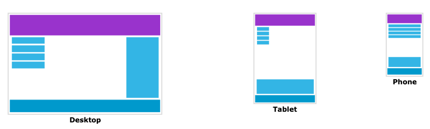

# 05 Responsive CSS

<!-- TOC -->

- [Responsive positioning](#responsive-positioning)
- [Responsive sizing](#responsive-sizing)
- [Bonus: Another breakpoint](#bonus-another-breakpoint)
  <!-- TOC -->

Note that the `<meta name="viewport" content="width=device-width, initial-scale=1" />` is already added by Angular.

Open the `lab-05-responsive.html` and `lab-05-responsive.scss`.

## Responsive positioning

Try to add responsiveness to the layout. It should have 3 different states:

1. Mobile (default)
2. Tablet (600px and more)
3. Desktop (900px and more)

Your result should be looking like this:

## Responsive sizing

Try to adapt `font-size`, `line-height`, `margin` and `padding` for each of your breakpoints.

## Bonus: Another breakpoint

Add another breakpoint (or two) for large desktops. Again adapt your styling to the bigger screens.

Also, center the content and let it grow to a certain `max-width`. After that (end), bigger screens will just add blank margin to both sides. This is commonly used to avoid the content being stretched out too far.
