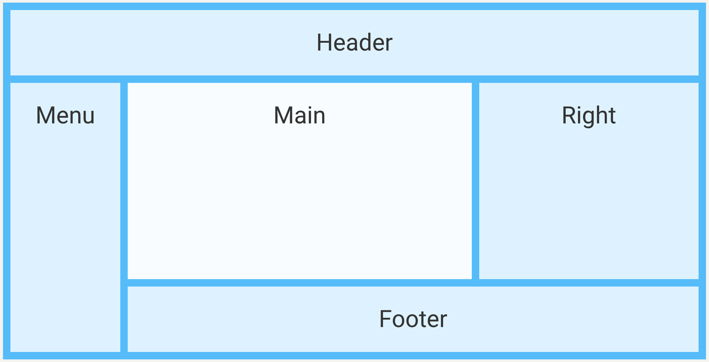

# 06 Modern CSS

<!-- TOC -->

- [Flexbox](#flexbox)
  - [Container](#container)
  - [Items](#items)
- [Grid](#grid)
  - [Container](#container-1)
  - [Items](#items-1)
- [Transforms](#transforms)
- [Transitions & animations](#transitions--animations)
- [Bonus: Custom properties (Variables)](#bonus-custom-properties-variables)
  <!-- TOC -->

Open the `lab-06-modern.html` and `lab-06-modern.scss`.

## Flexbox

### Container

Apply following styles to the `app-flex-container` `<div>`.

1. Add display flex to the flex container `<div>`.

   ```css
   display: flex;
   ```

2. Play with the 4 `flex-direction:` property values.

   ```css
   flex-direction: column;
   flex-direction: column-reverse;
   flex-direction: row;
   flex-direction: row-reverse;
   ```

3. Also test the `flex-wrap:` property values. To test you might need to use `row` and reszie your browser tab.

   ```css
   flex-wrap: wrap;
   flex-wrap: wrap-reverse;
   flex-wrap: nowrap;
   ```

4. Stick with your best choice and apply it via the `flex-flow:` shorthand. Which combination is suited best?

   ```css
   flex-flow: column wrap;
   flex-flow: row nowrap;
   ```

5. Try to `align-items` to the center.

   ```css
   align-items: center;
   ```

6. Also play with the `gap` property. Which other CSS rule could be replaced by the `gap`?

   ```css
   gap: 10px;
   ```

### Items

Now apply styles to just **1** of your items:

1. `flex-grow`
2. `flex-shrink`
3. `flex-basis`
4. Apply all three of them to another item using the `flex` shorthand.

## Grid

Below the flex playground you'll find another section for a grid.

### Container

1. Add `display: grid;` to the `app-grid-container` `<div>`.

   ```css
   display: grid;
   ```

2. Add a `gap` (shorthand for `row-gap` and `column-gap`):

   ```css
   gap: 10px;
   ```

3. Add the following grid configuration:

   ```css
   grid-template-columns: 40% 40% 20%;
   grid-template-rows: 200px 100px;
   ```

4. Comment out the `grid-template-columns` and the `grid-template-rows`, and then add the following areas to `grid-template-areas`:
   ```css
   grid-template-areas:
     'header header header header header'
     'menu main main main right'
     'menu footer footer footer footer';
   ```
   
5. Now add `grid-template-columns` and `grid-template-rows`, giving each area a size in `fr` unit:

   ```css
   grid-template-columns: 1fr 1fr 1fr 1fr 2fr;
   grid-template-rows: 1fr 3fr 1fr;
   ```

### Items

1. To make it work you'll also need to assign the items to a `grid-area`:

   ```css
   .app-grid-item1 {
     grid-area: header;
   }
   .app-grid-item2 {
     grid-area: menu;
   }
   .app-grid-item3,
   .app-grid-item4 {
     grid-area: main;
   }
   .app-grid-item5 {
     grid-area: right;
   }
   .app-grid-item6 {
     grid-area: footer;
   }
   ```

Your result should look like this:


Special bonus question: Why does the main area have a white `background-color`?

## Transforms

Now let's do some basic transforms.

Apply each of these functions to a div:

- translate()
- rotate()
- scale()
- skew()

## Transitions & animations

Now let's do some basic transforms.

1. Apply a `:hover` transition to the last div:

   ```css
   transition: transform 2s;
   ```

2. Add an easing function to it:

   ```css
   transition: transform 2s ease-in-out;
   ```

   Also try some other functions and choose the best option in your opinion.

3. Finally, add a small start delay to it:

   ```css
   transition: transform 2s ease-in-out 0.5s;
   ```

## Bonus: Custom properties (variables)

Add at least one custom properties to your `global.scss` and use it throughout components.

- You could use one for the margins / gaps, named `gutter-width` (`10px` or better `0.625rem`).
- Another one for your boxes, named `box-width` (`100px` or better `6.25rem`).

```css
:root {
  --gutter-width: 0.625rem;
  --box-width: 6.25rem;

  --background-color: #f4f3ef;
  --color: #333;
}
```

Now, try to replace all hardcoded values throughout the App with your custom properties.

## Bonus: Units (replace px as unit)

Let's practice units once more: Replace all `px` units with `rem` units in your styles - except for things like `border`, `outline` and `shadow`.
